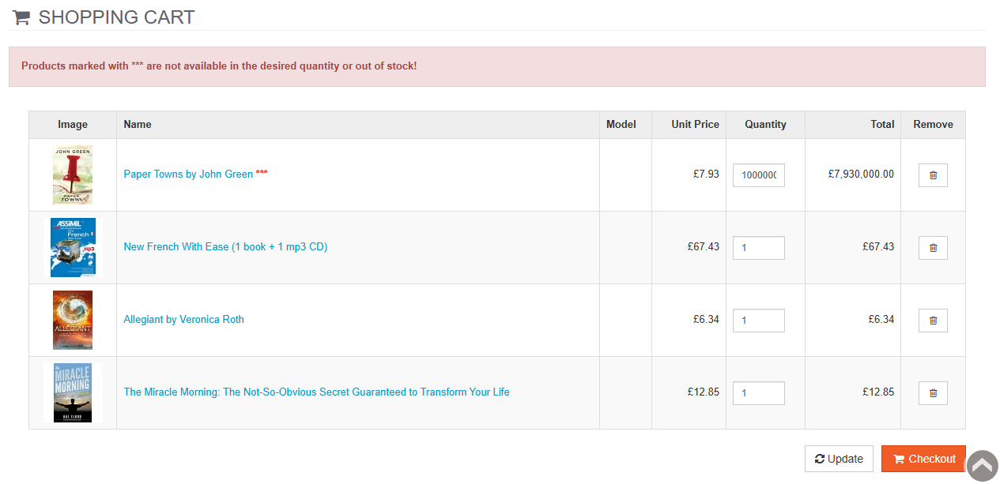
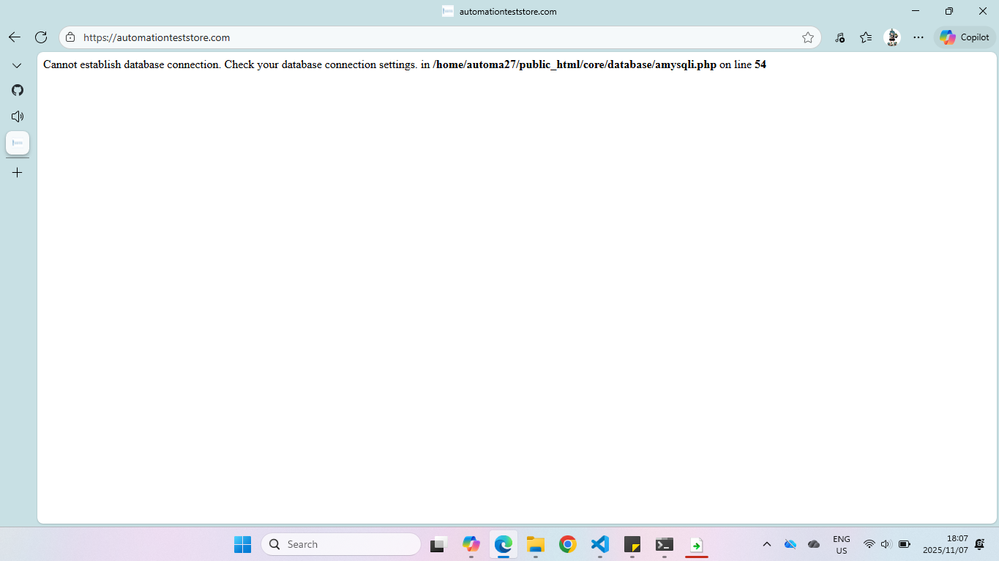

# Bug Report Template

**Title**:  
---
**Description**:

**Preconditions**:   

**Steps To Reproduce**: 

**Expected Result**: 

**Actual Result**: 

**Environment used**:   
- Browser: Microsoft Edge, Chrome  
- OS: Windows 11  
- Device: Desktop/Laptop

**Network used**:3G, 4G, Wifi 

**Status**: 

**Evidence**:

---

## Bug-001

**Title**: Book quantity is unexpectedly high
---
**Description**: 
When adding the paperback version of Paper Towns by John Green to the cart and reviewing the order, the quantity displayed is unexpectedly high — far exceeding the intended amount.

**Preconditions**:User is logged in  

**Steps To Reproduce**: 
1. Add the book Paper Towns into Cart.
2. Review the order

**Expected Result**: A single copy of the book is added to the cart   

**Actual Result**:Thousands of copies of the book are added to the  

**Environment used**:   
- Browser: Microsoft Edge, Chrome  
- OS: Windows 11  
- Device: Desktop/Laptop

**Network used**:3G, 4G, Wifi   

**Status**:Confirmed

**Evidence**:

---
## Bug 002

**Title**:  Store item has unlimited stock
---
**Description**:
Seaweed conditioner exceeds realistic stock 
**Preconditions**:user is logged in   

**Steps To Reproduce**:
1. Add the item "Seaweed conditioner" into cart
2. Increase the quantity excessively
3. Update the cart

**Expected Result**:Item stock displays an error message "Stock exceeded" 

**Actual Result**: no error message is displayed and stock price is adjusted  

**Environment used**:   
- Browser: Microsoft Edge, Chrome  
- OS: Windows 11  
- Device: Desktop/Laptop

**Network used**:3G, 4G, Wifi 

**Status**:Confirmed 
  
**Evidence**:
**Related Test Case**:[Fr-009](/Test_cases.md#fr-009-verify-if-user-is-not-able-to-select-stock-that-exceeds-the-max-limit-in-stock)

**Title**:  Website is down
---
**Description**:
The auomationteststore website is down, experiencing server connection issues

**Preconditions**: User is on the automation test store website   

**Steps To Reproduce**: 

**Expected Result**: Website is functional and responsive 

**Actual Result**:Website page displays a database connection error 

**Environment used**:   
- Browser: Microsoft Edge, Chrome  
- OS: Windows 11  
- Device: Desktop/Laptop

**Network used**:3G, 4G, Wifi 

**Status**:Resolved  

**Evidence**:

