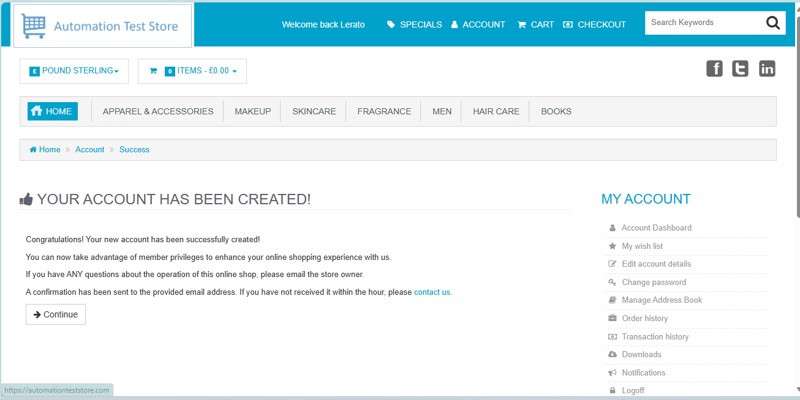
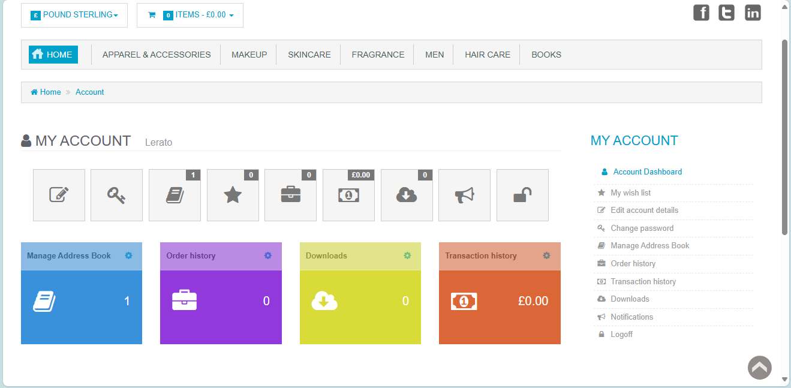
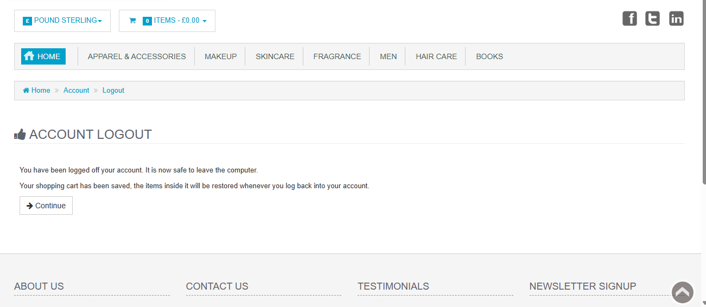
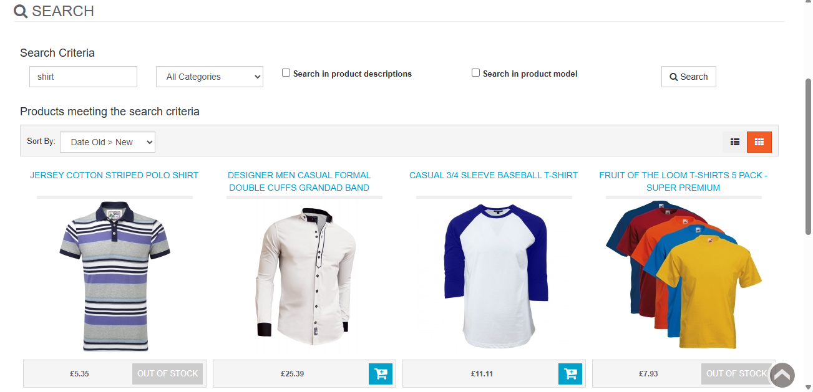
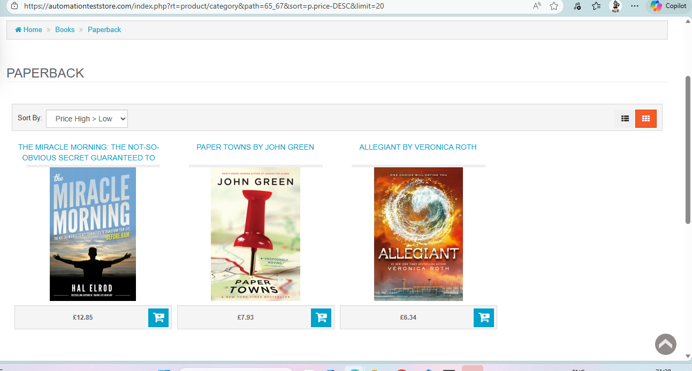
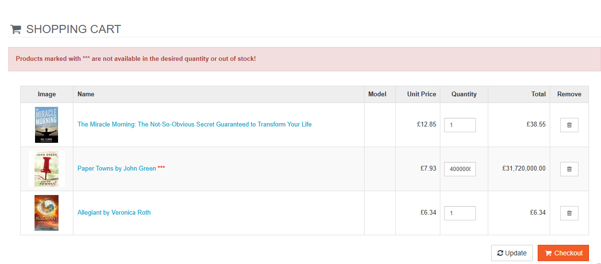
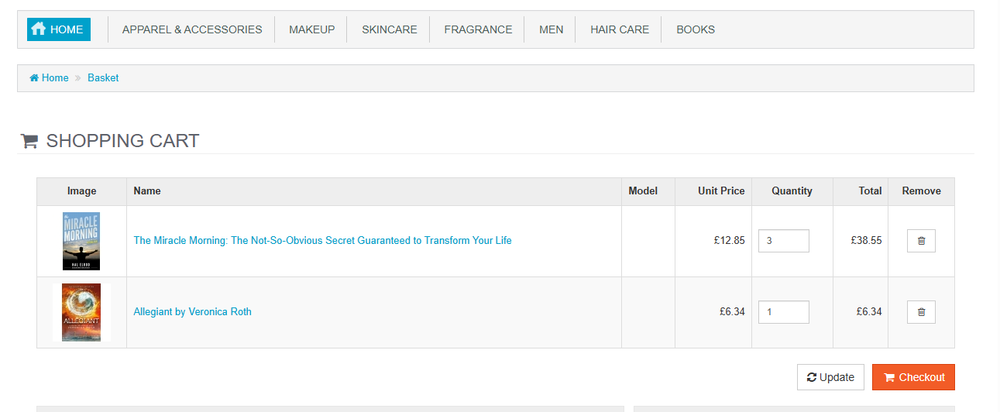
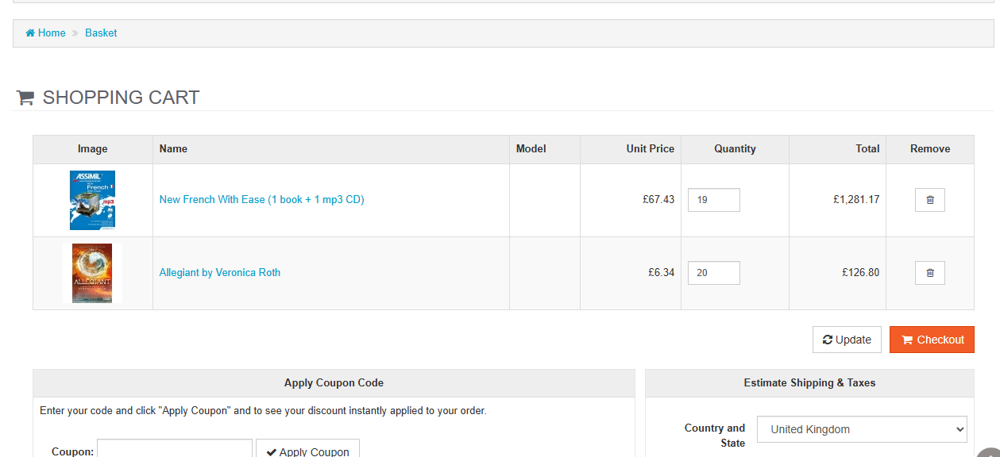
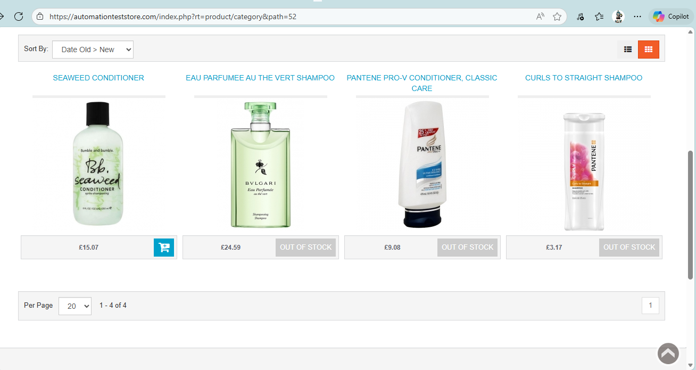
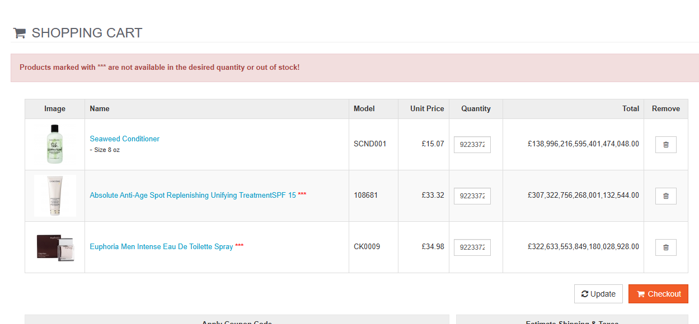

# Automation Test Store Test Cases

---
## Test Case template:
**Preconditions**: 
**Steps To Reproduce**:
**Expected Result**: 
**Actual Result**:
**Environment used**: Microsoft Edge, Chrome
**Status**: To be executed 
**Evidence**:

## User Account management:

### Fr-001: Verifying if user can register an account  

**Preconditions**:  <!-- Use faker for fake test data -->
User is on the registration page of the website
**Steps To Reproduce**:
1. Enter credentials(name,surname, email,number)
2. Enter your address
3. Enter login details(login name, password)

**Expected Result**: New user account is registered 
**Actual Result**: New user account is successfully created 
**Environment used**: Microsoft Edge
**Status**: Passed  
**Evidence**:

<!-- Use this template for future test cases -->

### Fr-002: Verify if user is able to login to account
**Preconditions**: User is on the "login or register" tab 
**Steps To Reproduce**:
1. Click on "Returning customer"
2. Enter your login name and password
3. Click on the "Login" button
**Expected Result**: User is logged into account 
**Actual Result**: User successfully logged in
**Environment used**: Microsoft Edge
**Status**: Passed 
**Evidence**:

### Fr-003: Verify if user able to logout of the account
**Preconditions**: 
User is logged into their account
**Steps To Reproduce**:
1. Click on the "logoff" button
**Expected Result**:User is logged out of the account 
**Actual Result**: User successfully logged out of the account
**Environment used**: Microsoft Edge
**Status**: Passed  
**Evidence**:

---

## Product search and discovery:

### Fr-004: Verify is user is able to search for items in stock
**Preconditions**: User is logged in to account 
**Steps To Reproduce**:
1. Search for an item on the "search" bar
2. Click Enter after writing item
3. Verify if item is in stock
**Expected Result**: Desired item is displayed and in stock 
**Actual Result**: Desired item is in stock and dispayed on screen
**Environment used**: Microsoft Edge
**Status**: Passed 
**Evidence**:

### Fr-005: Verify if user is able to filter items in stock
**Preconditions**: User is logged in 
**Steps To Reproduce**:
1. Select a category(e.g books)
2. Click on the "Sort by" dropdown and select from either Price high > low, or any other option displayed
**Expected Result**:Item is filtered according to criteria 
**Actual Result**: Items are successfully filtered based on selected criteria
**Environment used**: Microsoft Edge,
**Status**: Passed 
**Evidence**:

## Cart Operation

### FR-006: Verify if user is able to add or remove items in cart
**Preconditions**:User is logged in 
**Steps To Reproduce**:
1. Search for any iten
2. Add the item into cart
3. Remove the item from the cart
**Expected Result**:User is able to add and remove items in cart 
**Actual Result**: User successfuly added and removed items from cart
**Environment used**: Microsoft Edge
**Status**: Passed  
**Evidence**:
**Evidence**:

### Fr-007: Verify if user is able to select desired amount of item in stock
**Preconditions**:User is logged in 
**Steps To Reproduce**:
1. Add an item to the cart
2. Change the quantity of the item to any amount
3. Click on "Update" to adjust the overall price
**Expected Result**: User is able to change the quantity of the item 
**Actual Result**: User successfully changed the quantity of item
**Environment used**: Microsoft Edge
**Status**: Passed 
**Evidence**:

---
## Stock Validation

### Fr-008:Verify that the user is able to identify when a product is marked as out of stock.
**Preconditions**:User is logged in 
**Steps To Reproduce**:
1. Search for an item
**Expected Result**:Item(s) should display text when stock is unavalable 
**Actual Result**: Item(s) successfully display "Out Of Stock" text
**Environment used**: Microsoft Edge
**Status**: Passed  
**Evidence**:

### Fr-009: Verify if user is not able to select stock that exceeds the max limit in stock
**Preconditions**:User is logged in 
**Steps To Reproduce**:
1. Add item to cart
2. Increase the quantity of the item to an excessive amount
**Expected Result**:Error message stating insufficent stock is displayed 
**Actual Result**: Error message is displayed
**Environment used**: Microsoft Edge
**Status**: Passed 
**Evidence**:

### Fr-010: Verify if user can select stock that's below the min limit per customer
**Preconditions**: 
**Steps To Reproduce**:
**Expected Result**: 
**Actual Result**:
**Environment used**: Microsoft Edge, Chrome
**Status**: To be executed 
**Evidence**:

---
## Currency Conversion

### Fr-011: Verify if user is able to switch between currencies
**Preconditions**: 
**Steps To Reproduce**:
**Expected Result**: 
**Actual Result**:
**Environment used**: Microsoft Edge, Chrome
**Status**: To be executed 
**Evidence**:

### Fr-012: Verify if price of item is changed when currency is changed <!-- Change wording -->
**Preconditions**: 
**Steps To Reproduce**:
**Expected Result**: 
**Actual Result**:
**Environment used**: Microsoft Edge, Chrome
**Status**: To be executed 
**Evidence**:

## Checkout Process

### Fr-013: Verify if user can review items in cart
**Preconditions**: 
**Steps To Reproduce**:
**Expected Result**: 
**Actual Result**:
**Environment used**: Microsoft Edge, Chrome  
**Status**: To be executed 
**Evidence**:

### Fr-014: Verify if user can enter their address for item delivery
**Preconditions**: 
**Steps To Reproduce**:
**Expected Result**: 
**Actual Result**:
**Environment used**: Microsoft Edge, Chrome 
**Status**: To be executed 
**Evidence**:

### Fr-015: Verify if user is able to checkout
**Preconditions**: 
**Steps To Reproduce**:
**Expected Result**: 
**Actual Result**:
**Environment used**: Microsoft Edge, Chrome 
**Status**: To be executed 
**Evidence**:

---
 ## Input Validation

 ### Fr-016: Verify if error message is displayed when login name and/or email address are incorrect
 **Preconditions**: 
**Steps To Reproduce**:
**Expected Result**: 
**Actual Result**:
**Environment used**: Microsoft Edge, Chrome 
**Status**: To be executed 
**Evidence**:

### Fr-017: Verify if error message is displayed when login name and email address length exceed 50 characters
**Preconditions**: 
**Steps To Reproduce**:
**Expected Result**: 
**Actual Result**:
**Environment used**: Microsoft Edge, Chrome 
**Status**: To be executed 
**Evidence**:

### Fr-018: Verify if error message is displayed when login name and email address length are < 8 characters
**Preconditions**: 
**Steps To Reproduce**:
**Expected Result**: 
**Actual Result**:
**Environment used**: Microsoft Edge, Chrome 
**Status**: To be executed 
**Evidence**:

### Fr-019: Verify if error message is displayed when login name/email textbox is empty
**Preconditions**: 
**Steps To Reproduce**:
**Expected Result**: 
**Actual Result**:
**Environment used**: Microsoft Edge, Chrome 
**Status**: To be executed 
**Evidence**:

### Fr-020: Verify if error message is displayed when email address format is incorrect(e.g not "@" symbol)
**Preconditions**: 
**Steps To Reproduce**:
**Expected Result**: 
**Actual Result**:
**Environment used**: Microsoft Edge, Chrome 
**Status**: To be executed 
**Evidence**:

---
## Boundary-Value Testing

### Fr-021: Verify if login name and email accept inputs that are exactly 8 characters
**Preconditions**: 
**Steps To Reproduce**:
**Expected Result**: 
**Actual Result**:
**Environment used**: Microsoft Edge, Chrome 
**Status**: To be executed 
**Evidence**:

### Fr-022: Verify if login name and email accept inputs that are exactly 50 characters
**Preconditions**: 
**Steps To Reproduce**:
**Expected Result**: 
**Actual Result**:
**Environment used**: Microsoft Edge, Chrome 
**Status**: To be executed 
**Evidence**:

### Fr-023: Verify if login name and email inputs accept exactly 7 and 51 characters
**Preconditions**: 
**Steps To Reproduce**:
**Expected Result**: 
**Actual Result**:
**Environment used**: Microsoft Edge, Chrome 
**Status**: To be executed 
**Evidence**:

